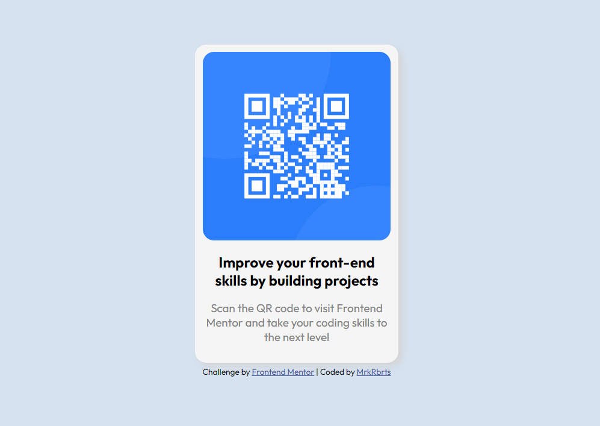

# Frontend Mentor - QR code component solution

This is a solution to the [QR code component challenge on Frontend Mentor](https://www.frontendmentor.io/challenges/qr-code-component-iux_sIO_H). Frontend Mentor challenges help you improve your coding skills by building realistic projects. 

## Table of contents

- [Overview](#overview)
  - [Screenshot](#screenshot)
  - [Links](#links)
- [My process](#my-process)
  - [What I learned](#what-i-learned)
  - [Continued development](#continued-development)
  - [Useful resources](#useful-resources)
- [Author](#author)
- [Acknowledgments](#acknowledgments)

**Note: Delete this note and update the table of contents based on what sections you keep.**

## Overview

### Screenshot

### Links

- Solution URL: [https://mrkrbrts.github.io/QR-code-component/]

## My process

### What I learned

Most of this task was pretty easy as I've completed a lot of similar tasks as part of Scrimba's Frontend Developer course.

CSS is definately my weakest quality as a developer. I'm always struggling to wrangle flexbox and positioning divs on the page, but I usually find my way with the help of [Flexbox Froggy] (https://flexboxfroggy.com/)

This is also my first time writing a README file. Pretty daunting, and I've tried to avoid it for as long as possible. However, the template Frontend Mentor have left is pretty snazzy!

### Continued development

Wow, I really need to brush up on my CSS and HTML structure. Don't worry, I'll be sure to get a lot more practice!

### Useful resources

- [Flexbox Froggy](https://flexboxfroggy.com/) - My go-to when flexbox is driving me insane. Nice and visual, you can see how each flexbox property affects the document in real time.

## Author

- Website - [Mark Roberts](https://mrkrbrts.dev/)
- Frontend Mentor - [@mrkrbrts](https://www.frontendmentor.io/profile/mrkrbrts)
- Twitter - [@mrkrbrts](https://www.twitter.com/mrkrbrts)

## Acknowledgments

Thank you Frontend Mentor! 

If you're starting your coding journey, or if you need a lil inspiration for a project, check them out: (https://www.frontendmentor.io/)